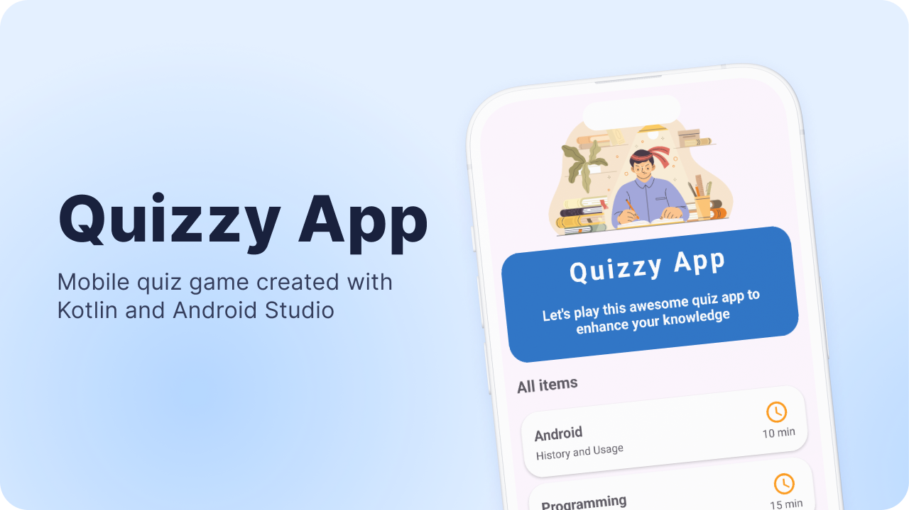

# Android quiz game with Firebase
Quizzy App is a quiz game where users can choose a category of questions and then answer questions with four possible answers (only one correct). Each category has its own time limit. The quiz is considered passed if the user scores at least 60% correct answers.



**Features:**
- **Category selection for questions**.
- **Time-limited quizzes based on category**.
- **Questions with four answer choices**.
- **Pass the quiz by scoring 60% or more correct answers**.
- **Questions and categories stored in Firebase Realtime Database**.

## Technologies Used
- **Programming Language**: Kotlin.
- **IDE**: Android Studio.
- **Backend**: Firebase Realtime Database.
- **Dependency Management**: Gradle.

## Installation
**1. Clone the repository**
```sh
git clone https://github.com/mamatkulovdmitry/AndroidQuizGameWithFirebase.git
```
**2. Open the project in Android Studio**
* Open Android Studio;
* Select `File > Open` and choose the project directory.

**3. Install dependencies**
* Android Studio will automatically install the necessary dependencies via Gradle.

**4. Setup Firebase**
* Go to the [Firebase Console](https://console.firebase.google.com).
* Create a new project or select an existing project.
* Download the `google-services.json` file provided by Firebase.
* Place the `google-services.json` file in the `QuizGame/app` directory.

**5. Configure the Firebase Database**
* In the Firebase Console, go to the Realtime Database section.
* Create the necessary database structure for questions and categories in JSON format.
* You can use the `Questions.json` file provided in the repository to populate the database with your quiz data.
  - Upload the `Questions.json` file to your Firebase Realtime Database.

**6. Run the application**
* Ensure your device or emulator is set up.
* Run the application from Android Studio.
* Verify that the app connects to Firebase and retrieves the quiz data correctly.

## Usage
* Launch the application on your device or emulator.
* Choose a question category.
* Answer the questions within the allotted time.
* View your results at the end of the quiz.

## Contribution
* If you would like to contribute to the project, please fork the repository and submit a pull request. We welcome all improvements and additions.

## License
* This project is licensed under the MIT License. See the `LICENSE` file for details.

## Documentation
* [Kotlin](https://kotlinlang.org/docs/home.html).
* [Firebase](https://firebase.google.com/docs).
* [Android Studio](https://developer.android.com/studio/intro).

## Authors

- [@mamatkulovdmitry](https://github.com/mamatkulovdmitry)
